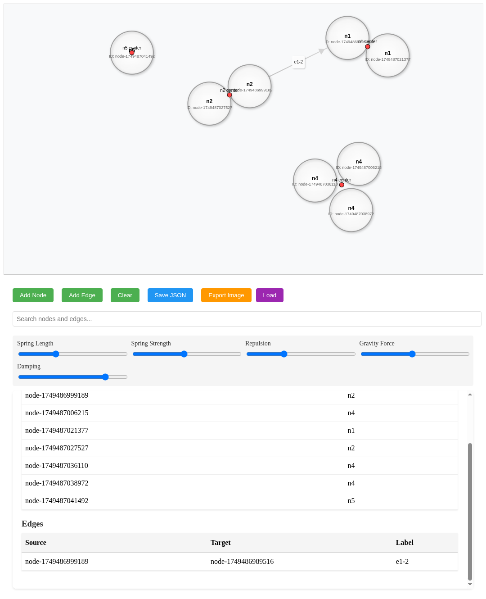

# Graph Visualizer

An interactive web-based graph visualization tool that allows users to create, manipulate, and analyze directed graphs with labeled nodes and edges.



## Features

- Interactive graph visualization with drag-and-drop nodes
- Force-directed layout with adjustable parameters
- Smart label-based node grouping with visual centers
- Beautiful gradients and modern styling
- Add/remove nodes and edges with custom labels
- Save and load graph data as JSON
- Export graph visualization as PNG
- Intelligent search functionality for nodes and edges
- Smooth pan and zoom controls with boundaries
- Real-time table view of nodes and edges
- Enhanced visual feedback with shadows and gradients
- Highlight connections on hover
- Performance optimized with frame rate control

## Controls

- **Pan**: Middle mouse button or Alt + Left mouse button
- **Zoom**: Mouse wheel
- **Drag Nodes**: Left mouse button
- **Add Node**: Click "Add Node" button and enter label
- **Add Edge**: Click "Add Edge" button and enter source/target IDs and label

## Force-Directed Layout Controls

- Spring Length: Controls the ideal distance between connected nodes
- Spring Strength: Adjusts how strongly connected nodes attract each other
- Repulsion: Controls how strongly nodes repel each other
- Gravity Force: Adjusts the force pulling nodes toward the center
- Damping: Adjusts how quickly node movement stabilizes

The visualization also features:
- Automatic node grouping based on labels
- Visual group centers for better organization
- Smart boundary management
- Adaptive force scaling based on node relationships
- Performance optimized animation frames

## Installation

1. Clone this repository:
```bash
git clone https://github.com/vanchaklar/graph-visualizer.git
cd graph-visualizer
```

2. Open `index.html` in a modern web browser.

## File Structure

```
/
├── index.html          # Main HTML file
├── css/
│   └── styles.css     # Stylesheet
└── js/
    └── visualizer.js  # Graph visualization logic
```

## Dependencies

No external dependencies required! The visualizer is built with vanilla JavaScript, HTML5 Canvas, and CSS.

## License

feel free to use this project for personal or commercial purposes.
